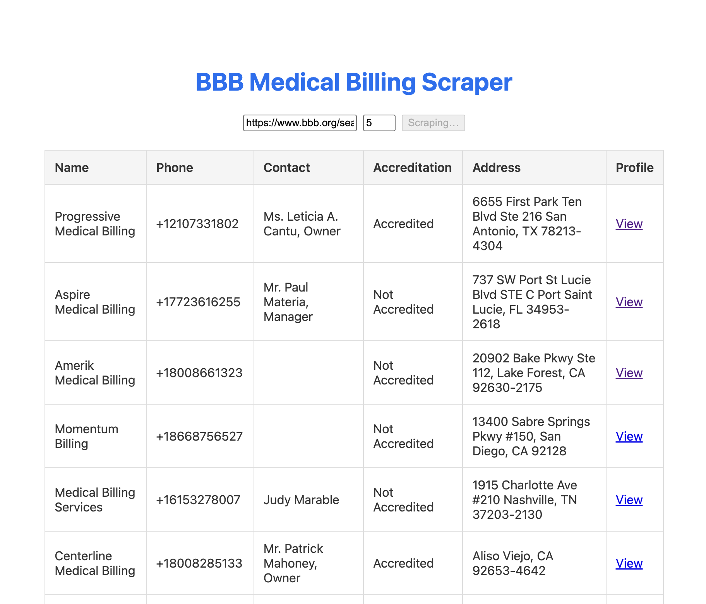

# BBB Medical Billing Scraper

A three‐phase project to scrape “A‑rated Medical Billing” listings from BBB, wrap it in an LLM‑driven Stagehand module, and surface results in a Next.js + Supabase web app.
This project utilizes advanced LLM-based web-scraping, a persistent storage database using Supabase, and next.js/React frontend interface.

## Overview

This repository contains three distinct phases:

- **Phase A**: A Playwright‑based Python scraper that collects A‑rated “Medical Billing” listings from the Better Business Bureau and outputs a CSV.  
- **Phase B**: A Stagehand‑compatible TypeScript module to programmatically invoke the scraper via LLM‑driven browser automation.  
- **Phase C**: A Next.js + Supabase web application that provides a UI to trigger the scraper, persists results to a Supabase table, and displays them.


---

## Phase A: Python Scraper

### Goal

Scrape pages 1–15 of the BBB “Medical Billing” search results and export a deduplicated CSV.

### Search URL

```text
https://www.bbb.org/search?filter_category=60548-100&filter_category=60142-000&
filter_ratings=A&find_country=USA&find_text=Medical+Billing&page=1
```


### Method Overview

- **Library:** Playwright (Python sync API)  
- **Pages:** 1–15 of the BBB “Medical Billing” search results  
- **Data Extracted per listing:**  
  - `name`  
  - `phone` (normalized to E.164, e.g. `+14155551234`)  
  - `principal_contact`  
  - `url` (link to detail page)  
  - `address`  
  - `accreditation` status  

- **Deduplication:** by `(name, phone)`  
- **Politeness:** 1–3 s random delays, headful mode to bypass Cloudflare  

### Reproduction Instructions

```bash
cd scraper
python3 -m venv .venv
source .venv/bin/activate
pip install -r requirements.txt
python -m playwright install
python bbb_scraper.py
```

* **Output:** `medical_billing_companies.csv` in `scraper/` directory
* **Python version:** 3.10+
* **Dependencies** in `scraper/requirements.txt`

Issues Encountered
* **Cloudflare "Just a moment…"** page — mitigated by headful mode (`browser.launch(headless=False)`) and random delays
* **Selector timeouts** — added fallback selectors (`div.card.result-card`, `h3.result-business-name`)
* **ModuleNotFoundError** for `playwright` — ensure you install and run under the same environment (`python -m playwright install`)

Phase B: Stagehand Automation Module

### How to Call

You can invoke the scraper from TypeScript or Node.js:

```ts
import { runBBBScraper } from './index';

async function example() {
  const { businesses, csvContent, totalCount } = await runBBBScraper({
    targetUrl: 'https://www.bbb.org/search?…&page=1',
    maxPages: 5,
    stagehandConfig: {
      env: 'LOCAL',
      modelClientOptions: {
        apiKey: process.env.OPENAI_API_KEY
      },
      apiKey: process.env.BROWSERBASE_API_KEY,
      projectId: process.env.BROWSERBASE_PROJECT_ID
    }
  });
  
  console.log(`Scraped ${totalCount} entries`);
  // businesses is an array of { name, phone, url, principal_contact, address, accreditation }
}
```
## Phase B: Stagehand Automation Module

### Invocation Steps

#### Install
```bash
npm install
npm run start
```

### Configure environment in .env or stagehand.config.
```
OPENAI_API_KEY=…
BROWSERBASE_API_KEY=…
BROWSERBASE_PROJECT_ID=…
```
### Run CLI
npm start -- "https://…&page=1" 3

### Return Value:
* **JSON containing { businesses: CompleteBusiness[], csvContent: string, totalCount: number }**

* **CSV written to working directory (optional)**

## Phase C: Web App & Database Integration

### Setup & Run

```
cd bbb_scraper
npm install
```

### Create .env.local from .env.local.example and fill:
```
NEXT_PUBLIC_SUPABASE_URL=…
NEXT_PUBLIC_SUPABASE_ANON_KEY=…
SUPABASE_SERVICE_ROLE_KEY=…
OPENAI_API_KEY=…
BROWSERBASE_API_KEY=…
BROWSERBASE_PROJECT_ID=…
```

### Start Next.js dev server
```
npm run dev
```

### Visit
```
http://localhost:3000
```

### Enter BBB Search URL & page count

* **Click Start Scrape**

* **Results are persisted to Supabase and displayed in a table**
